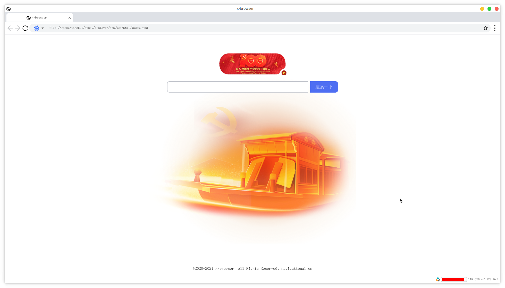

<h1 align="center">

</h1>

<b>x-browser is an open source Java web browser, that implements by javafx webview component</b>

# Build

To build x-browser, execute the following command:

    gradlew build

To run the main demo, execute the following command:

    gradlew run

**NOTE** : You need to set JAVA_HOME environment variable to point to Java 16 directory.

**NOTE** : x-browser requires **Java 16** and above.

# SNAPSHOT

